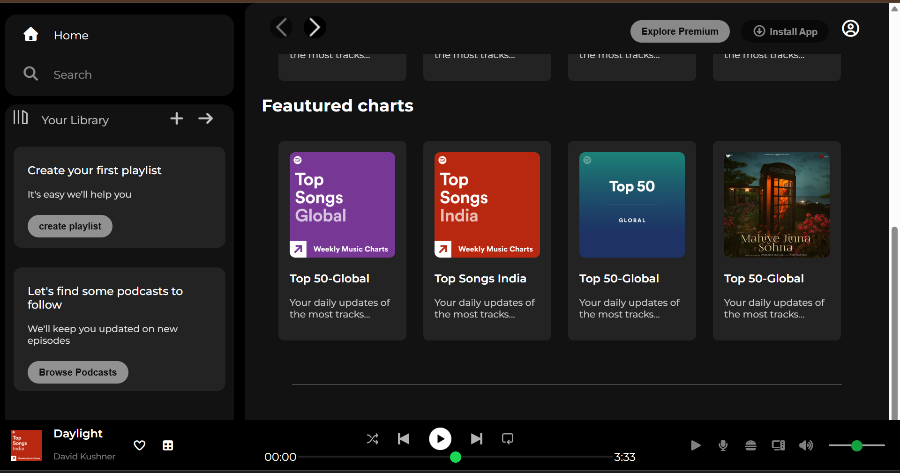

# Spotify UI Clone

A responsive Spotify-inspired web interface built using HTML5 and CSS3.

## Overview

This project recreates the look and feel of Spotify's user interface using only HTML and CSS. It was built to practice front-end development concepts such as layout design, styling, and responsive web design.

## Features

- Responsive design
- Spotify-inspired user interface
- Custom CSS styling
- Clean and organized code structure

## Technologies Used

- HTML5
- CSS3

## Project Screenshots

## Author

Raghav Bansal
